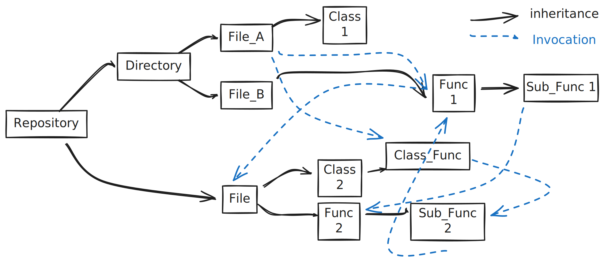
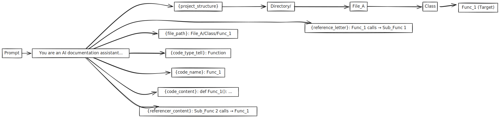

# RepoAgent: LLM-Powered Repository Documentation Generation

## Introduction

**RepoAgent** is an open-source, LLM-powered framework designed for automated repository-level code documentation generation. It has Bidirectional Reference Tracking by doing AST-Based Code Analysis.


---

## Topological Structure and Processing Order

RepoAgent processes code objects in **topological order** based on their dependencies. This ensures that when documenting a function, the documentation for all functions it calls is already available.



The **solid arrows** represent parent-child relationships (containment), while the **dashed arrows** represent **reference relationships** (calls/dependencies). 

RepoAgent uses these relationships to:

1. Build a dependency graph
2. Compute topological order
3. Generate documentation bottom-up (leaf nodes first)

The diagram above illustrates how RepoAgent models a repository:

| Level | Components | Description |
|-------|------------|-------------|
| **Repository** | Root node | The entire codebase |
| **Directory** | Folders | Organizational structure |
| **File** | `.py` files | Individual source files |
| **Class** | `ClassDef` | Class definitions |
| **Function** | `FunctionDef` | Top-level functions |
| **Class_Func** | Methods | Functions within classes |
| **Sub_Func** | Nested functions | Functions defined inside other functions |


---

## How RepoAgent Prompts Are Generated

RepoAgent uses a **template-based prompt system** with dynamic variable injection. The diagram below shows how repository structure maps to prompt sections:



### System Prompt Template

The core template is defined in `repo_agent/prompt.py`:

```python
doc_generation_instruction = (
    "You are an AI documentation assistant... \n\n"
    
    "Currently, you are in a project, the hierarchical structure is:\n"
    "{project_structure}\n\n"                        # ← Repository/Directory/File hierarchy
    
    "The path of the document is {file_path}.\n"     # ← e.g., repo_agent/runner.py/Runner/run
    'Generate a document for a {code_type_tell}, '   # ← Class or Function
    'whose name is "{code_name}".\n\n'               # ← e.g., generate_doc
    
    "The content of the code is as follows:\n"
    "{code_content}\n\n"                             # ← Actual source code
    
    "{reference_letter}\n"                           # ← Objects THIS code calls (→ dashed arrows)
    "{referencer_content}\n\n"                       # ← Objects that CALL this (← dashed arrows)
    
    "... [output format instructions] ..."
)
```

### Dynamic Variable Injection

For each code object, RepoAgent's `ChatEngine.build_prompt()` method fills in the template variables:

| Variable | Source | Example Value |
|----------|--------|---------------|
| `{project_structure}` | Hierarchical tree | File structure with current object marked |
| `{file_path}` | `doc_item.get_full_name()` | `repo_agent/runner.py/Runner/run` |
| `{code_name}` | Object name | `generate_doc` |
| `{code_type_tell}` | AST node type | `Function` or `Class` |
| `{code_content}` | Source code | The actual function/class code |
| `{reference_letter}` | Called objects | Code + docs of functions this calls |
| `{referencer_content}` | Calling objects | Code + docs of functions calling this |
| `{language}` | User config | `English`, `Chinese`, etc. |

### Reference Context Injection

A key feature is the **bidirectional reference context**. When documenting a function:

```python
def get_referenced_prompt(doc_item: DocItem) -> str:
    """Includes documentation of objects THIS code calls"""
    prompt = ["As you can see, the code calls the following objects:"]
    for reference_item in doc_item.reference_who:
        instance_prompt = f"""
        obj: {reference_item.get_full_name()}
        Document: {reference_item.md_content[-1]}
        Raw code: {reference_item.content['code_content']}
        """
        prompt.append(instance_prompt)
    return "\n".join(prompt)

def get_referencer_prompt(doc_item: DocItem) -> str:
    """Includes documentation of objects that CALL this code"""
    prompt = ["Also, the code has been called by the following objects:"]
    for referencer_item in doc_item.who_reference_me:
        instance_prompt = f"""
        obj: {referencer_item.get_full_name()}
        Document: {referencer_item.md_content[-1]}
        Raw code: {referencer_item.content['code_content']}
        """
        prompt.append(instance_prompt)
    return "\n".join(prompt)
```

This recursive traversal of dependencies creates **rich context** for each documentation request, but also creates unique prompts for every object.

---

## Prefix Cache Hit Rate Analysis

Both `Func_1` and `Sub_Func_2` call `Sub_Func_1` (see dashed arrows in topo.svg). When generating documentation for each, `Sub_Func_1`'s code appears in the `{reference_letter}` section—but at **different positions**:

```
PROMPT FOR Func_1                          PROMPT FOR Sub_Func_2
═══════════════════════════                ═══════════════════════════

┌─────────────────────────┐                ┌─────────────────────────┐
│ "You are an AI..."      │ ← MATCH        │ "You are an AI..."      │
├─────────────────────────┤                ├─────────────────────────┤
│ {project_structure}     │ ← MATCH        │ {project_structure}     │
├─────────────────────────┤                ├─────────────────────────┤
│ path: File_A/Class/     │                │ path: File_B/Class_2/   │
│       Func_1            │ ✗ MISMATCH     │       Sub_Func_2        │
├─────────────────────────┤ ↑              ├─────────────────────────┤
│ code: def Func_1():     │ PREFIX         │ code: def Sub_Func_2(): │
│       ...               │ BREAKS         │       ...               │
├─────────────────────────┤ HERE           ├─────────────────────────┤
│ {reference_letter}:     │                │ {reference_letter}:     │
│ ┌─────────────────────┐ │                │ ┌─────────────────────┐ │
│ │ ★ Sub_Func_1 code ★ │ │ SAME           │ │ ★ Sub_Func_1 code ★ │ │
│ │ def Sub_Func_1():   │ │ CONTENT        │ │ def Sub_Func_1():   │ │
│ │     return x + 1    │ │ BUT...         │ │     return x + 1    │ │
│ └─────────────────────┘ │                │ └─────────────────────┘ │
├─────────────────────────┤                ├─────────────────────────┤
│ format instructions...  │                │ format instructions...  │
└─────────────────────────┘                └─────────────────────────┘
         │                                          │
         └────────────┬─────────────────────────────┘
                      │
                      ▼
    ┌─────────────────────────────────────────────────────┐
    │  ❌ PREFIX CACHING: Sub_Func_1 code NOT REUSABLE    │
    │                                                     │
    │  The identical Sub_Func_1 code block appears at     │
    │  DIFFERENT token positions in each prompt.          │
    │  Prefix caching requires exact prefix match—fails   │
    │  because path/code differs before Sub_Func_1.       │
    └─────────────────────────────────────────────────────┘
```

### Observed Results

Analysis of RepoAgent traces from [LLM Agent Trace Viewer](https://v0-llm-agent-dashboard.vercel.app/trace/cbf07b3c) reveals:

| Metric | Value |
|--------|-------|
| **Total Traces** | 186 |
| **Avg Input Length** | 14,608 characters (~3,650 tokens) |
| **Prefix Cache Hit Rate** | **4%** |
| **Prefix Match Range** | 0% - 24% per request |

### Why Prefix Caching Fails

**Prefix caching** requires the **exact beginning** of prompts to match character-by-character. In RepoAgent, this assumption breaks immediately:

```
┌────────────────────────────────────────────────────────────────────┐
│ "You are an AI documentation assistant..."     (~100 chars)       │ ✓ MATCHES
├────────────────────────────────────────────────────────────────────┤
│ "project structure is: {DYNAMIC_PROJECT_TREE}"                    │ ✗ BREAKS
├────────────────────────────────────────────────────────────────────┤
│ "file path is repo_agent/runner.py/Runner/run"                    │ 
│ "code is: def run(self): ..."                                     │  Unique per
│ "reference: [doc of called functions]"                            │  request
│ "referencer: [doc of calling functions]"                          │
└────────────────────────────────────────────────────────────────────┘
```

**Root Causes:**

1. **Early Dynamic Variables**: `{project_structure}` and `{file_path}` appear within the first 200 characters, immediately breaking prefix alignment

2. **Unique Code Content**: Every request documents a different function/class with unique source code

3. **Variable Reference Context**: The `{reference_letter}` and `{referencer_content}` sections vary based on each object's call relationships

4. **Topological Processing**: Objects are processed by dependency order, not file proximity, so consecutive requests often document unrelated code

### Comparison: Request 1 vs Request 2

```
Request 1: "You are an AI... project is tests/test_json_handler.py/TestJsonFileProcessor..."
Request 2: "You are an AI... project is repo_agent/runner.py/Runner/run..."
                                       ↑
                              PREFIX BREAKS HERE (~150 chars in)
```

Result: Only **~1% of tokens** are reusable via prefix caching.

---

## How Non-Prefix Caching Improves Hit Rate

### The Non-Prefix Advantage

Unlike prefix caching, **non-prefix (substring) caching** can match and reuse **any contiguous block** of tokens, regardless of position. This fundamentally changes what can be cached:

```
┌─────────────────────────────────────────────────────────────────┐
│ STATIC: "You are an AI documentation assistant, and your task  │
│ is to generate documentation based on the given code..."       │ → CACHEABLE
│ (~2000 chars of instruction template)                          │   BLOCK #1
├─────────────────────────────────────────────────────────────────┤
│ DYNAMIC: file_path, code_name, project_structure               │ → NOT CACHED
├─────────────────────────────────────────────────────────────────┤
│ REUSED: "obj: repo_agent/utils/meta_info_utils.py/func_X       │
│ Document: [previously generated doc]                           │ → CACHEABLE
│ Raw code: def func_X(): ..."                                   │   BLOCK #2
│ (Same reference appears in multiple requests)                   │
├─────────────────────────────────────────────────────────────────┤
│ STATIC: "Please note: - Any part of the content you generate   │
│ SHOULD NOT CONTAIN Markdown..."                                 │ → CACHEABLE
│ (~500 chars of formatting instructions)                         │   BLOCK #3
└─────────────────────────────────────────────────────────────────┘
```

### Cacheable Components in RepoAgent

| Component | Size | Frequency | Prefix Cacheable | Non-Prefix Cacheable |
|-----------|------|-----------|------------------|----------------------|
| System instruction template | ~2,000 chars | Every request | ❌ Breaks at position ~150 | ✅ Cache entire block |
| Output format specification | ~500 chars | Every request | ❌ After dynamic content | ✅ Cache entire block |
| Common utility functions | ~300-800 chars each | Referenced by many objects | ❌ Position varies | ✅ Cache when repeated |
| Previously generated docs | ~200-500 chars each | Injected as context | ❌ Position varies | ✅ Cache when repeated |

### Empirical Results

LMCache benchmarks demonstrate the dramatic improvement:

| Caching Strategy | Hit Rate | Improvement |
|------------------|----------|-------------|
| **Prefix Caching** | 4% | Baseline |
| **Non-Prefix Caching** | **70%+** | **17.5x improvement** |


### Why Non-Prefix Works for Agent Workflows

RepoAgent exhibits patterns common to many LLM agents:

1. **Recursive Dependency Traversal**: To document class `A`, RepoAgent may need documentation from classes `B`, `C`, `D`. To document class `E`, it may need `B`, `C`, `F`. Classes `B` and `C` appear in both prompts but at **different positions**.

2. **Shared Reference Context**: Popular utility functions (e.g., `logger`, `settings`, `file_handler`) are called by many objects. Their code and documentation appear in numerous prompts.

3. **Static Instruction Blocks**: The ~2,500 character instruction template is identical across all 186 requests but appears **after** dynamic project structure information.

Non-prefix caching captures all three patterns; prefix caching captures none.

---

## Implications for LLM Agent Design

### Recommendations

1. **For Agent Developers**: When building recursive or reference-heavy agents like RepoAgent, expect prefix caching to be ineffective. Design prompts with non-prefix caching in mind.

2. **For Infrastructure**: LLM serving systems should implement substring/block matching algorithms to maximize cache efficiency for agent workloads.

3. **For Prompt Engineering**: Consider prompt restructuring to move static content earlier, but recognize that for complex agents, non-prefix caching is often the only effective solution.

### The Broader Pattern

RepoAgent represents a growing class of LLM applications where:
- Prompts contain **reusable components** (instructions, reference docs, examples)
- These components appear at **variable positions** due to dynamic context
- Traditional prefix caching provides **<10% hit rates**
- Non-prefix caching can achieve **>70% hit rates**

This pattern extends to RAG systems, multi-agent frameworks, code analysis tools, and any application with recursive or compositional prompt construction.

---

## References

- [RepoAgent GitHub Repository](https://github.com/OpenBMB/RepoAgent)
- [LMCache Agent Trace Benchmarks](https://github.com/LMCache/lmcache-agent-trace)
- [RepoAgent Paper (arXiv:2402.16667)](https://arxiv.org/abs/2402.16667)
- [LLM Agent Trace Viewer](https://v0-llm-agent-dashboard.vercel.app/trace/cbf07b3c)
