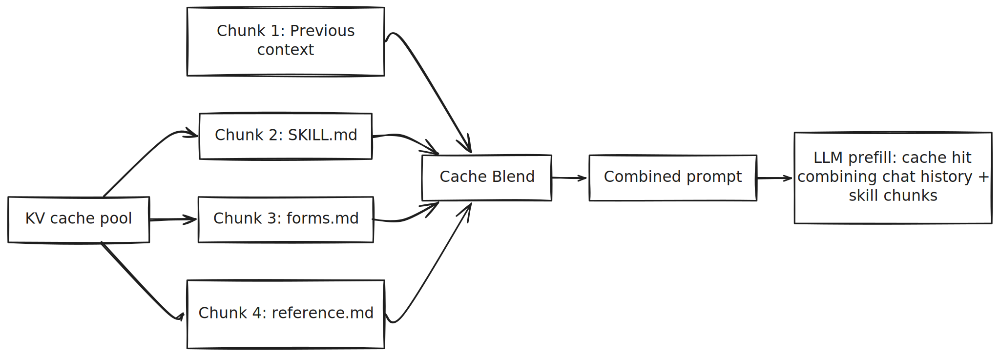

# Skill File Caching Strategy for LLM Context Editing

## Overview

We propose a strategy for caching [skills](https://www.anthropic.com/engineering/equipping-agents-for-the-real-world-with-agent-skills) files (like `SKILL.md` and their referenced files) to enable efficient LLM prompt caching through context editing. By pre-processing and storing skill documentation in the correct format, we can achieve **85%+ cache hit rates** on skill-related content.


Skill is a progressive disclosure: it provides just enough information in first several lines in skill.md - for Claude to know when each skill should be used without loading all of it into context. The actual body of this file is the second level of detail. If Claude thinks the skill is relevant to the current task, it will load the skill by reading its full SKILL.md into context.


## Problem Statement

When LLM agents use skill files (e.g., [PDF processing skills](https://github.com/anthropics/skills/blob/main/skills/pdf/SKILL.md)), the skill documentation is inserted into the user context. Without proper caching:

- Each request re-sends the full skill documentation
- No prefix matching occurs with previous requests
- Token costs and latency increase linearly

## Solution: Pre-cached Skill Pool

###  Skill Files to Cache

For each skill, cache the main skill file and all referenced files:

```
skills/pdf/
├── SKILL.md          # Main skill documentation
├── forms.md          # Referenced: PDF form filling guide
└── reference.md      # Referenced: Advanced PDF operations
```


#### Context Editing for Cache Hits

Traditional prefix caching requires skill content to appear at the **exact same position** in every prompt. However, with **CacheBlend**, we can concatenate pre-cached skill KV states with the existing context at any position.



**Key Advantage**: With CacheBlend, the skill content doesn't need to be at the prompt prefix. It can appear **after** dynamic content (user request, conversation history) and still achieve cache hits by concatenating pre-computed KV states.


### Cache Hit Analysis

With proper caching, we observed these results on skill-related requests:

| Record | Delta Words | Matched | Hit Rate |
|--------|-------------|---------|----------|
| forms.md content | 1,752 | 1,490 | **85.0%** |
| SKILL.md content | 1,315 | 836 | **63.6%** |
| Plan mode messages | 902 | 603 | **66.9%** |


### Benefits

1. **Reduced Token Costs**: 85% of skill content hits cache → only 15% new tokens processed
2. **Lower Latency**: Cached prefixes enable faster response generation
3. **Consistent Behavior**: Pre-cached content ensures consistent skill documentation

## Best Practices

### DO:
- ✅ Cache all skill files and their references
- ✅ Place skill content early in prompts for maximum prefix matching
- ✅ Update cache when skill files change
- ✅ Use consistent prompt structure across requests

### DON'T:
- ❌ Insert dynamic content before skill documentation
- ❌ Modify skill content between requests
- ❌ Split skill files across different parts of the prompt

## File Structure

```
cache/
├── skills/
│   ├── pdf/
│   │   ├── SKILL.md
│   │   ├── forms.md
│   │   └── reference.md
│   └── other_skills/
│       └── ...
└── pool_index.json  # Metadata about cached entries
```

## Conclusion

By pre-caching skill files and structuring prompts for prefix matching, we can achieve significant cache hit rates (65-85%) on skill-related content. This reduces token costs and latency while maintaining consistent skill documentation across requests.

The key insight is that **prompt structure matters** - placing skill content early and consistently in prompts enables maximum prefix matching and cache efficiency.
